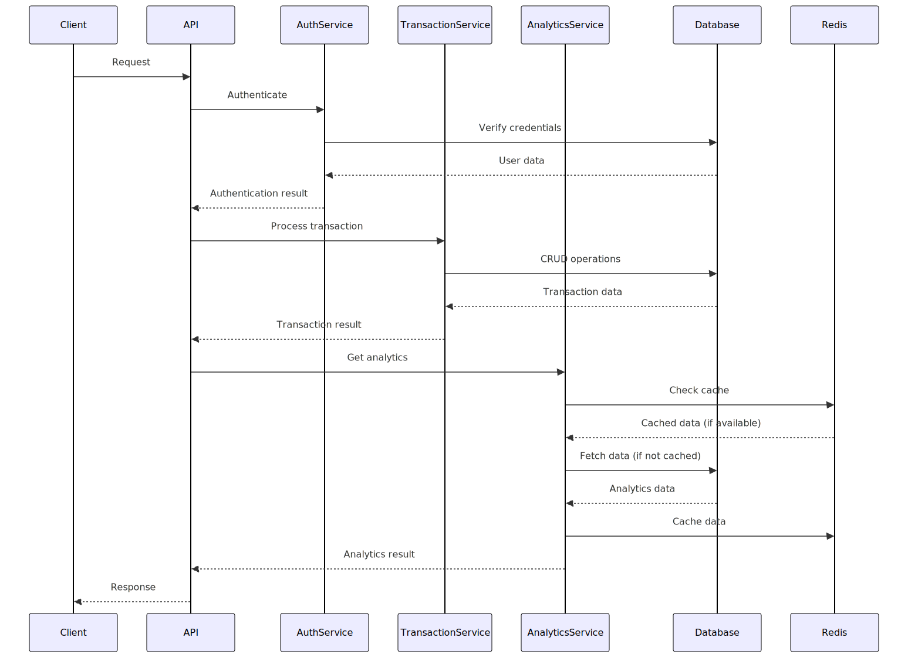

# Fido Transaction API

This is a simple API for managing transactions in a database. It uses FastAPI and PostgreSQL as the database and Redis as the cache. 


NB: All requests are authenticated using JWT tokens. The API is secured by default. You must register and login to get your token for the subsequence requests.

Whenever you get a 401 error, you must login again to get a new token.

```json
{
    "detail": "Could not validate credentials"
}
```
```
```

## Prerequisites

- Python 3.12 or higher
- PostgreSQL 16 or higher
- Redis

## Installation

1. Clone the repository:

```bash
git clone https://github.com/yeboahd24/fido-transaction-api.git
```

2. Install the required dependencies:

```bash
pip install -r requirements.txt
```

3. Create a `.env` file in the root directory and add the following environment variables:

```bash
DB_USER=postgres
DB_PASSWORD=postgres
DB_NAME=postgres
DB_HOST=localhost
DB_PORT=5432
REDIS_HOST=localhost
REDIS_PORT=6379
ENCRYPTION_KEY=your_encryption_key
JWT_SECRET_KEY=your_jwt_secret_key
JWT_ALGORITHM=HS256
```

Replace `your_encryption_key`, `your_jwt_secret_key`, and `your_jwt_algorithm` with your own values.

4. Run the application:

```bash
uvicorn app.main:app --reload
```

## Usage

NB: The documentation for this project is also hosted on [Postman](https://documenter.getpostman.com/view/14925315/2sAY52cf3d)

### Registering a user

To register a new user, send a POST request to the `/auth/register` endpoint with the following JSON payload:

```json
{
  "username": "your_username",
  "email": "your_email",
  "password": "your_password"
}
```

### Logging in

To log in a user, send a POST request to the `/auth/login` endpoint with the following JSON payload:

```json
{
  "username": "your_username",
  "password": "your_password"
}
```

The response will contain the access token and other relevant information.

### Creating a transaction

To create a new transaction, send a POST request to the `/transactions` endpoint with the following JSON payload:

```json
{
  "full_name": "John Doe",
  "transaction_date": "2023-01-01",
  "transaction_amount": 100.0,
  "transaction_type": "credit"
}
```

The response will contain the transaction details, including the ID, full name, transaction date, transaction amount, and transaction type.

### Updating a transaction

To update a transaction, send a PUT request to the `/transactions/{transaction_id}` endpoint with the following JSON payload:

```json
{
  "full_name": "Jane Doe",
  "transaction_date": "2023-02-01",
  "transaction_amount": 200.0,
  "transaction_type": "debit"
}
```

The response will contain the updated transaction details, including the ID, full name, transaction date, transaction amount, and transaction type.

### Deleting a transaction

To delete a transaction, send a DELETE request to the `/transactions/{transaction_id}` endpoint.

The response will contain a success message.

### Getting user analytics

To get user analytics, send a GET request to the `/analytics` endpoint.

The response will contain the user's analytics data, including the full name, total transactions, total credit, total debit, average transaction value, and the busiest day.

NB: The analytics data is cached in Redis for improved performance
Also analytics can be filtered by date, `GET /analytics/?transaction_date=2024-11-10`

## Docker

To run the application using Docker, follow these steps:

1. Build the Docker image:

```bash
docker-compose build
```

2. Run the Docker container:

```bash
docker-compose up -d
```
You can run the tests with Docker Compose using the command:
```bash
docker-compose up --abort-on-container-exit --exit-code-from test test
```

## Design Decision

### Context and scope

This project is a Transaction API built using FastAPI and PostgreSQL,
with Redis for caching. The API provides functionality for user authentication,
transaction management, and analytics.
The system is designed to handle user registration, login, and
secure access to transaction-related operations.
The API is containerized using Docker for easy deployment and scalability.


### Goals and non-goals

#### Goals:

1. Provide secure user authentication using JWT tokens

2. Allow CRUD operations for transactions

3. Offer user analytics based on transaction data

3. Implement caching for improved performance

4. Ensure data encryption for sensitive information

5. Support containerized deployment

#### Non-goals:

1. Implement real-time transaction processing

2. Provide multi-factor authentication

3. Support multiple database backends

4. Implement a front-end interface


## Design

#### System-context-diagram




## APIs

The API exposes the following main endpoints:

### Authentication:

`POST /auth/register`: Register a new user

`POST /auth/login`: Log in a user and receive a JWT token

### Transactions:

`POST /transactions`: Create a new transaction

`PUT /transactions/{transaction_id}`: Update an existing transaction

`DELETE /transactions/{transaction_id}`: Delete a transaction

### Analytics:

`GET /analytics`: Retrieve user analytics data


## Data storage

### PostgreSQL:

`Users table`: Stores user information (id, username, email, hashed_password)

`Transactions table`: Stores transaction data (id, user_id, full_name, transaction_date, transaction_amount, transaction_type)

### Redis:

used for caching analytics data with a key format of "analytics:{user_id}"


## Code and pseudo-code

The main components of the system are:

1. `AuthService`: Handles user registration and login

2. `TokenService`: Manages JWT token creation and verification

3. `TransactionService`: Manages CRUD operations for transactions

4. `AnalyticsService`: Processes and caches user analytics data

5. `AuthenticateUserMiddleware`: Ensures secure access to protected endpoints

### Key implementation details:

1. Password hashing is used for secure storage of user passwords

2. JWT tokens are used for authentication, with configurable expiration times

3. Redis is used to cache analytics data for improved performance

4. Database queries are performed asynchronously using the databases library

5. Error handling and logging are implemented throughout the application


### Degree of constraint

This project has a moderate degree of constraint. The solution space is defined by the chosen technologies (FastAPI, PostgreSQL, Redis) and the requirements for secure authentication and transaction management. However, there is flexibility in how these components are integrated and how specific features are implemented.


### Alternatives considered

Using SQLAlchemy ORM instead of raw SQL queries:

    Pro: More Pythonic approach to database operations

    Con: Potential performance overhead for simple queries

    Decision: Stick with raw SQL for better performance and control

Implementing WebSocket for real-time updates:

    Pro: Would allow for real-time transaction notifications

    Con: Increases complexity and may not be necessary for the current use case

    Decision: Not implemented to keep the API focused on core functionality

Using a NoSQL database like MongoDB:

    Pro: More flexible schema for evolving data structures

    Con: Less suitable for structured financial data and complex queries

    Decision: Stick with PostgreSQL for ACID compliance and robust querying capabilities

Implementing rate limiting:

    Pro: Would protect against potential abuse of the API

    Con: Adds complexity and may not be necessary for a small-scale application

    Decision: Consider implementing in the future if needed

Using OAuth2 for authentication:

    Pro: Allows for third-party authentication providers

    Con: More complex to implement and may be overkill for the current requirements

    Decision: Stick with custom JWT implementation for simplicity and control

The chosen design provides a good balance between functionality, security, and performance, while leaving room for future enhancements as needed.


## Contributing

Contributions are welcome! If you find any issues or have suggestions for improvements, please open an issue or submit a pull request on the GitHub repository.
